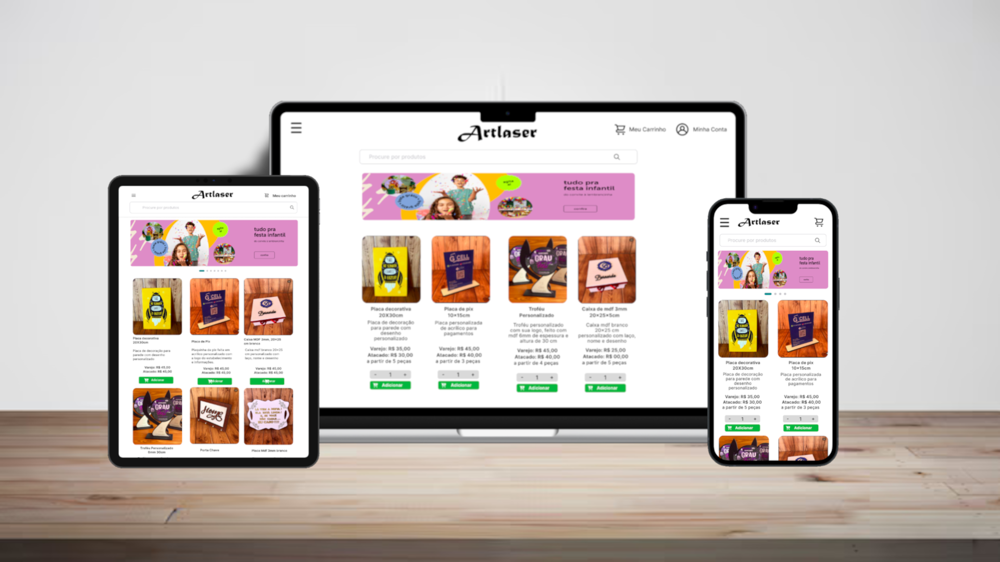

# Artlaser 

## Sobre

O sistema ecommerce funciona como um catálogo online, onde tanto clientes quanto administradores podem facilmente adicionar, modificar e remover produtos. Nosso sistema permite que os clientes naveguem pelos itens e categorias, além de consultar preços diretamente pelo site, sem a necessidade de assistência de um funcionário.

## Tecnologias

## Índice

- [Artlaser ](#artlaser-)
  - [Sobre](#sobre)
  - [Tecnologias](#tecnologias)
  - [Índice](#índice)
  - [Funcionalidades](#funcionalidades)
  - [Instalação](#instalação)
  - [Uso](#uso)
  - [Fotos](#fotos)
  - [Contatos](#contatos)
- 

## Funcionalidades

- **Requisitos Funcionais**

  - O administrador deve poder cadastrar um novo produto.
  - O administrador deve poder visualizar dados de um produto.
  - Deverá ser possível alterar e excluir determinado produto.
  - O administrador poderá adicionar banners e fazer alteração dos mesmos.

- **Regras de Negócio**
  - O participante só pode se inscrever em um evento uma única vez.
  - O participante só pode se inscrever em eventos com vagas disponíveis.
  - O participante só pode realizar check-in em um evento uma única vez.

## Instalação

- **Instalação**
  - npm install
- **Rodando o tailwind**
  - npm run dev
- **Rodando o servidor**
  - npm run start

## Uso

Será utilizado pelo estabeleciomento como forma de catálogo online para mostrar os produtos e facilitar aos clientes a visualização e preços dos produtos de forma simples e prática.

## Fotos

## Contatos

#
